# Итоговый проект: ИИ‑приложение в Kubernetes (Java + Docker + K8s + Monitoring + Trends)

Цель: разработать контейнерное Java‑приложение (REST API) для mock‑анализа тональности текста и развернуть его в Kubernetes с балансировкой, ingress‑маршрутизацией, автоскейлингом и мониторингом (Prometheus+Grafana), а также подготовить аналитический отчёт по тенденциям (arXiv 2024–2025).

Репозиторий содержит:
- `app/` — исходники приложения + Dockerfile (Spring Boot + Actuator + Prometheus endpoint).
- `k8s/` — манифесты Kubernetes: Deployment / Service / Ingress / HPA.
- `k8s/monitoring/` — ServiceMonitor для Prometheus Operator.
- `Docs/Screenshots/` — доказательства выполнения по шагам (скриншоты).
- `Docs/trends-arxiv.md` — отчёт по трендам (2–3 страницы, 3+ статей arXiv).

---

## 1) Подготовка инфраструктуры (Minikube / KillerCoda)

По ТЗ можно использовать Minikube локально, но в качестве альтернативы использована онлайн‑лаборатория KillerCoda (аналог Minikube для проверки без локальной установки).

Базовая диагностика Kubernetes/окружения:
- Скрин: инициализация окружения/проверка кластера  
  

---

## 2) Контейнеризация Java‑приложения

### 2.1. REST API
Приложение предоставляет endpoint:
- `GET /api/sentiment?text=hello` → JSON с результатом mock‑тональности.

### 2.2. Monitoring endpoint (Actuator)
Для пункта 4 мониторинга добавлен Spring Boot Actuator endpoint:
- `GET /actuator/prometheus` (экспорт метрик Prometheus).

### 2.3. Docker
Контейнеризация выполнена в `app/Dockerfile`.

Доказательства:
- Dockerfile  
  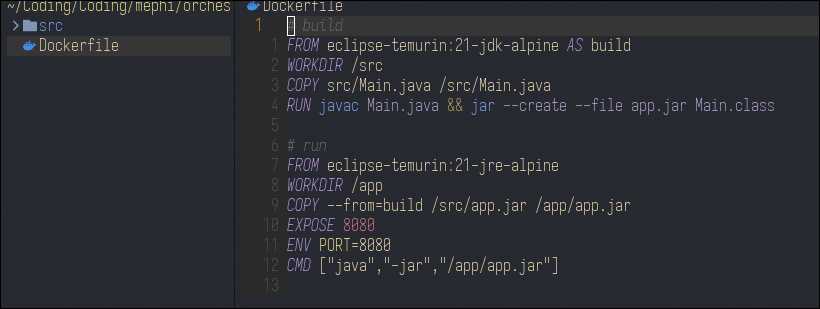
- Сборка образа  
  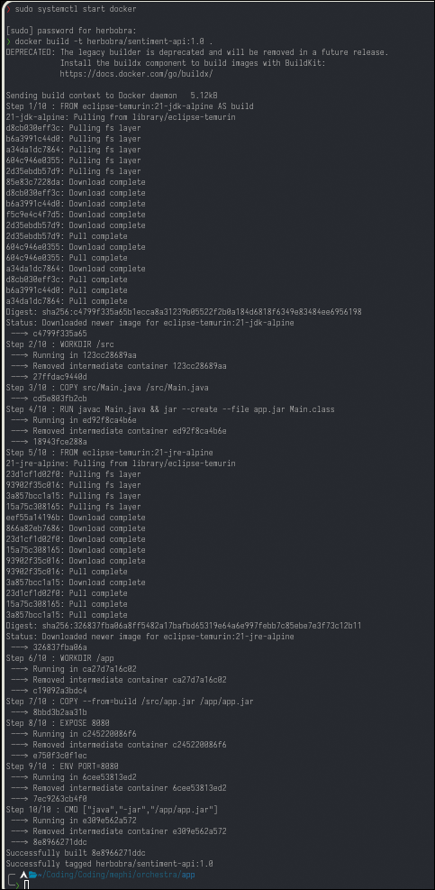
- Публикация (push) образа  
  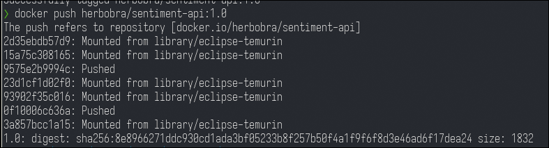
- Проверка размера образа/списка образов  
  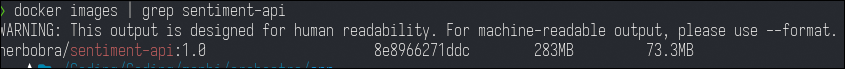

---

## 3) Развёртывание в Kubernetes (3 реплики + LoadBalancer + Ingress + HPA)

В папке `k8s/` находятся манифесты:
- `deployment.yaml` — Deployment с 3 репликами.
- `service.yaml` — Service типа LoadBalancer.
- `ingress.yaml` — Ingress для маршрутизации запросов на `/api`.
- `hpa.yaml` — HorizontalPodAutoscaler по CPU.

Доказательства YAML:
- Deployment YAML  
  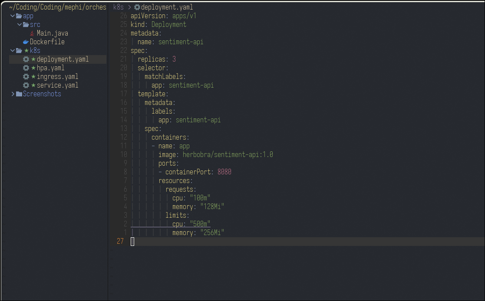
- Service YAML  
  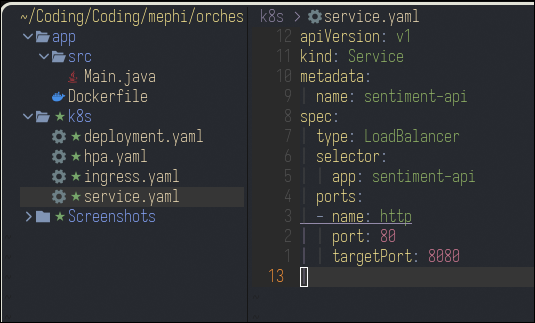
- Ingress YAML  
  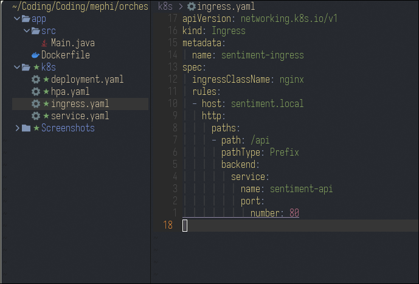
- HPA YAML  
  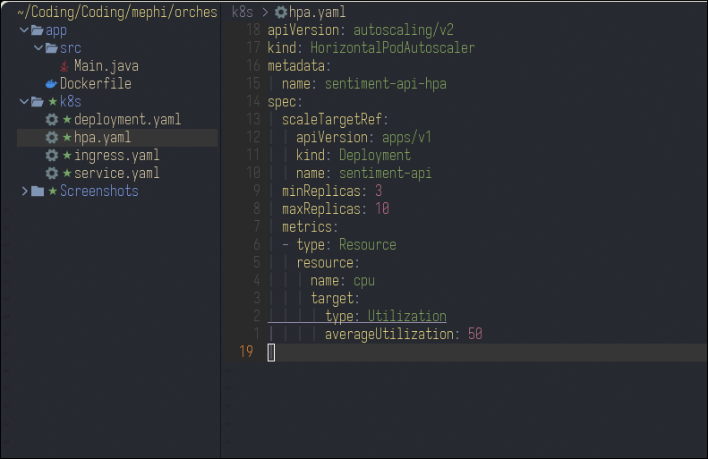

Доказательства применения и статуса:
- Применение манифестов (`kubectl apply -f k8s/`)  
  
- Состояние подов после исправления ошибок (все Running, 3 реплики)  
  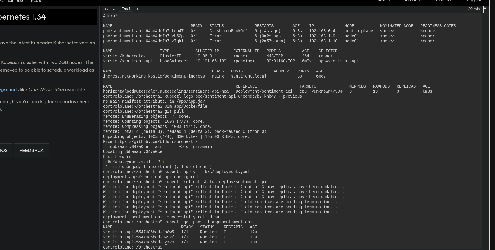
- Проверка Service (тип LoadBalancer, порты)  
  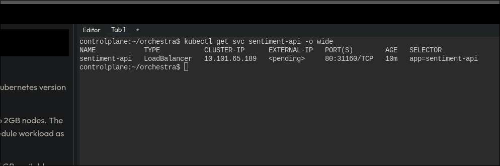
- Тестирование API запросом (curl)  
  
- Проверка HPA  
  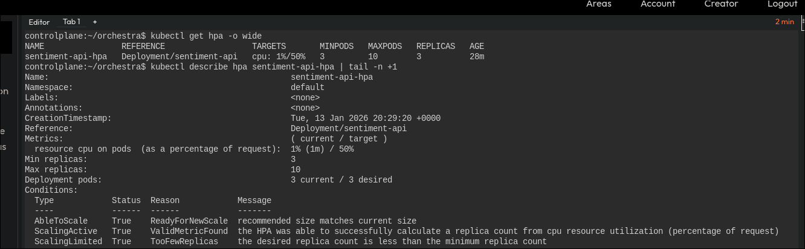

Ingress‑контроллер:
- Ingress‑nginx в кластере  
  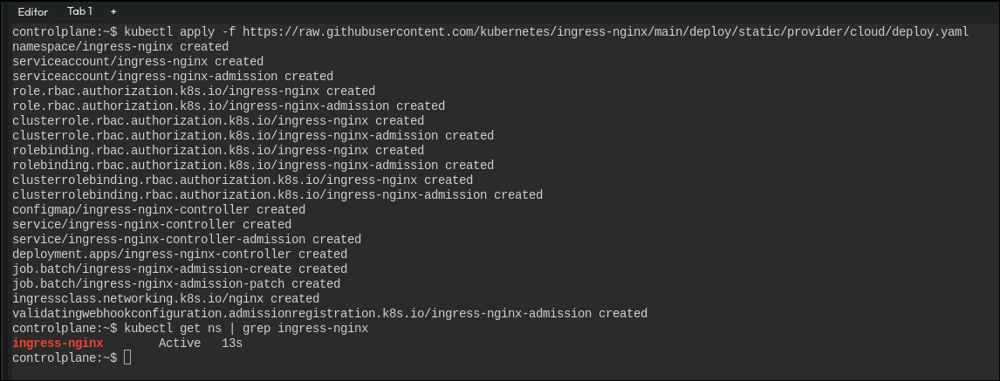

---

## 4) Мониторинг (Prometheus + Grafana через Helm)

### 4.1. Подготовка метрик приложения
Проверка, что метрики доступны:
- `/actuator/prometheus` внутри кластера  
  

### 4.2. Установка Prometheus+Grafana
Установка выполнена через Helm по ТЗ:
- `helm repo add prometheus-community https://prometheus-community.github.io/helm-charts`
- `helm install prometheus prometheus-community/kube-prometheus-stack`

Доказательства:
- Установка kube-prometheus-stack (helm)  
  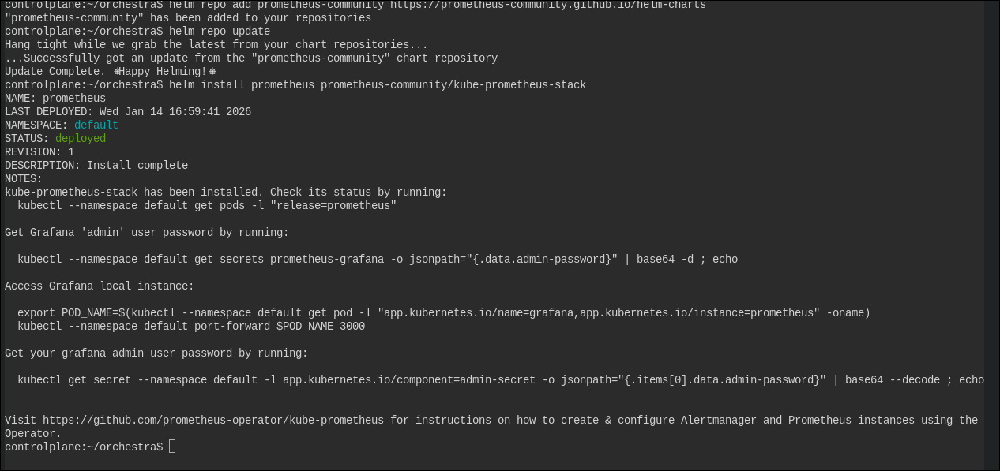
- Создание/настройка ServiceMonitor для приложения  
  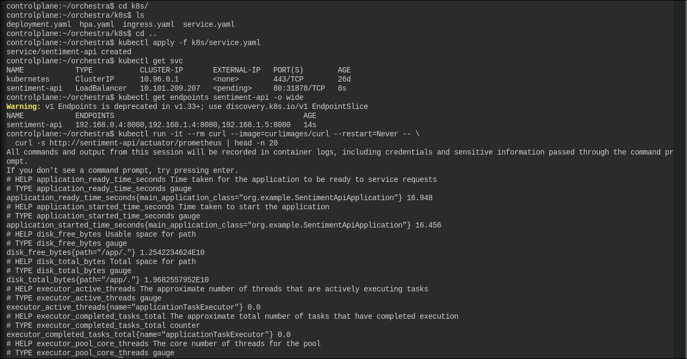
- Проверка, что Prometheus и Grafana поднялись  
  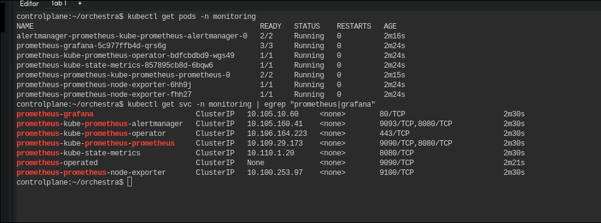

### 4.3. Проверка Prometheus без UI
Так как UI в песочнице не доступен, проверка сделана через Prometheus HTTP API:

- Prometheus Ready  
  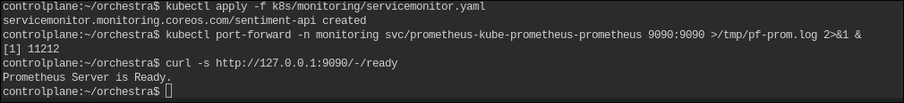
- `up == 1` для таргета `sentiment-api` (все 3 реплики)  
  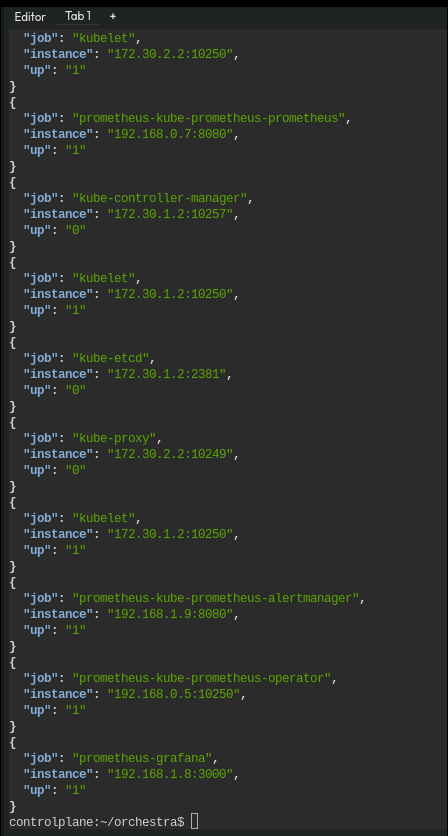
- Дополнительная проверка запроса в Prometheus (пример)  
  
---

## 5) Анализ тенденций (arXiv, 2024–2025)

- `Docs/trends-arxiv.pdf`

В отчёте:
- найдено 3+ статей arXiv по теме “AI Kubernetes containerization 2024–2025”
- выделены тенденции:
  - ИИ‑оптимизация распределения ресурсов
  - Бессерверный ИИ в Kubernetes
  - RL для планирования задач/автоскейлинга
- приведены выводы и связь с практическим проектом

---

### Быстрый запуск (для проверки)

#### Локально (Docker)
1) Собрать образ:
```bash
cd app
docker build -t sentiment-api:local .
```

2) Запустить:
```bash
docker run -p 8080:8080 sentiment-api:local
```

3) Проверить:
```bash
curl "http://localhost:8080/api/sentiment?text=hello"
curl "http://localhost:8080/actuator/prometheus" | head
```


#### В Kubernetes

```bash
kubectl apply -f k8s/
```
